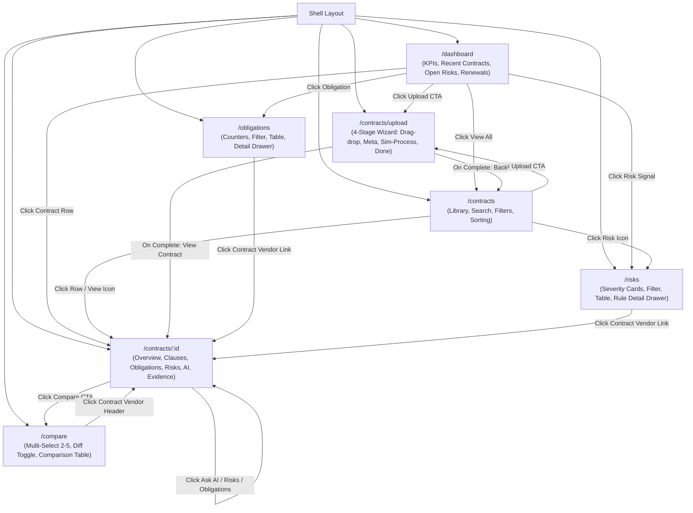

# FLOW.md — System & Application Flow Specification

This document details how **ContractIQ** operates today and how the complete, end-to-end architecture is planned to operate in future phases.

---

## PART 1: CURRENT IMPLEMENTATION (Phase 0 Baseline)

### 1. High-Level Component Hierarchy

```
[index.html]
   │
   ▼
[main.tsx]
   │
   ▼
[App.tsx] (BrowserRouter + Routes)
   │
   ▼
[Shell.tsx] (Global Layout Shell)
   ├── [Sidebar.tsx]  (Navigation, Logo, Profile, Route links)
   ├── [Header.tsx]   (Breadcrumbs, Global Search Input, Notifications Dropdown, Upload CTA)
   └── <main> (<Outlet />)
          ├── [Dashboard.tsx]         Route: / or /dashboard
          ├── [Contracts.tsx]         Route: /contracts
          ├── [UploadContract.tsx]    Route: /contracts/upload
          ├── [ContractOverview.tsx]  Route: /contracts/:id
          ├── [Obligations.tsx]       Route: /obligations
          ├── [RiskMonitor.tsx]       Route: /risks
          └── [Compare.tsx]           Route: /compare
```

---

### 2. Current Navigation Flow & Page Relationships



---

### 3. Current Mock Data Flow

All dynamic data currently flows synchronously from in-memory records in `src/data/mock.ts`:

```
                    ┌─────────────────────────┐
                    │    src/data/mock.ts     │
                    │                         │
                    │  - contracts: Contract[]│
                    │  - risks: Risk[]        │
                    │  - obligations: Oblig[] │
                    │  - auditEvents: Audit[] │
                    └───────────┬─────────────┘
                                │
       ┌────────────────┬───────┴────────┬────────────────┬──────────────┐
       ▼                ▼                ▼                ▼              ▼
[Dashboard.tsx]  [Contracts.tsx]  [Overview.tsx]   [Obligations.tsx] [RiskMonitor.tsx]
 - Computes KPIs  - Filters by:    - Looks up       - Filters by:     - Filters by:
 - Computes risk    type, risk,      contract by      status,           severity,
   distribution     search term      id               priority          status
 - Slices recent  - Sorts by:      - Filters risks  - Displays side   - Displays side
   contracts,       lastUpdated,     by contractId    drawer with       drawer with
   open risks,      renewal,       - Filters oblig.   evidence snippet  rule details
   renewals         vendor, risk     by contractId
```

*Note on Local Component Data:*
- `sampleClauses` is currently defined locally in `src/pages/ContractOverview.tsx`.
- `comparisonCategories` is currently defined locally in `src/pages/Compare.tsx`.
- `pipelineSteps` is simulated in `src/pages/UploadContract.tsx` via `setInterval` step increments without persistent backend mutation.

---

## PART 2: PLANNED SYSTEM FLOW (Target Architecture)

The following pipelines describe the intended production architecture. These components are **NOT YET IMPLEMENTED** and represent target workflows for subsequent phases.

---

### 1. Target End-to-End System Architecture

```
User (Browser)
   │
   ▼
Frontend (React 19 + Tailwind + Vite SPA)
   │
   ▼ HTTPS / REST API
Backend API Server (FastAPI / Node.js)
   ├── Authentication & RBAC Middleware
   ├── Contract Document Ingestion Service
   ├── Hybrid Retrieval & Search Engine
   ├── Structured LLM Extraction Engine
   └── Deterministic Risk Rules Engine
   │
   ▼
PostgreSQL Database
   ├── Relational Tables (Users, Contracts, Clauses, Obligations, Risk Signals, Audit Logs)
   └── pgvector Extension (Chunk Embeddings & HNSW/IVFFlat Vector Index)
```

---

### 2. Document Ingestion & Processing Pipeline

When a user uploads a contract PDF, the system converts the unstructured document into indexed evidence and structured domain entities:

```
Contract PDF Upload
   │
   ▼
1. File Validation & Virus Scan
   │ (Check MIME type, size limit, page count)
   ▼
2. Text Extraction & OCR
   │ (Extract text preserving page numbers, section headers, tables)
   ▼
3. Chunking & Boundary Segmentation
   │ (Clause-aware chunking, keeping chunk + page metadata)
   ▼
4. Embedding Generation
   │ (Compute dense vectors for all chunks via embedding model)
   ▼
5. Dual Indexing in PostgreSQL
   ├── Vector Index: Chunks & embeddings inserted into pgvector
   └── Keyword Index: Full-text search tsvector generated for keyword matching
   │
   ▼
6. Structured Clause & Fact Extraction
   │ (LLM extracts key contractual entities via structured output schema)
   ▼
7. Deterministic Risk Rule Evaluation
   │ (Business rule engine evaluates extracted structured facts)
   ▼
8. Contract Ready & Indexed
   (Database committed; user notified via UI)
```

---

### 3. RAG Retrieval & Question Answering Flow

When a user asks a contract question (e.g. *"What is the notice period for early termination?"*):

```
User Query: "What is the notice period for early termination?"
   │
   ▼
Backend Retrieval Orchestrator
   │
   ├── Vector Search (pgvector cosine distance for semantic similarity)
   └── Keyword Search (PostgreSQL tsvector / BM25 for exact terms)
   │
   ▼
Hybrid Retrieval Fusion (Reciprocal Rank Fusion - RRF)
   │
   ▼
Reranker / Context Filtering
   │ (Top K relevant chunks selected with source page metadata)
   ▼
Sufficient Evidence Check?
   ├── NO  ──► Return "Not Found in Contract" (Avoid hallucination)
   │
   └── YES ──► Construct Grounded Prompt with Citations
                  │
                  ▼
               LLM (Gemini / OpenAI)
                  │
                  ▼
               Grounded Answer with Page-Level Evidence & Citations
                  │
                  ▼
               Frontend UI: Renders answer, highlights exact clause & source page
```

---

### 4. Risk Analysis Flow (Structured Facts + Deterministic Rules)

ContractIQ separates semantic extraction from business logic to guarantee auditable, predictable risk detection:

```
Contract Document
   │
   ▼
LLM Clause & Fact Extraction (Structured Outputs)
   │
   │ Extract exact structured data points:
   ├── notice_period_days: 15
   ├── auto_renewal: true
   ├── renewal_notice_deadline_days: 30
   ├── liability_cap_type: "uncapped_ip"
   └── governing_law: "California"
   │
   ▼
Deterministic Risk Rules Engine (Application Code)
   │
   │ Evaluate deterministic rules:
   ├─ Rule 1: IF notice_period_days < 30 THEN Severity = CRITICAL
   ├─ Rule 2: IF auto_renewal == true AND days_until_deadline < 45 THEN Severity = HIGH
   └─ Rule 3: IF liability_cap_type == "uncapped_ip" THEN Severity = HIGH
   │
   ▼
Risk Signals Generated (Database Record)
   ├── Risk Level (Critical / High / Medium / Low)
   ├── Triggered Rule Description
   ├── Extracted Fact
   ├── Source Clause & Exact Page Number
   ├── Evidence Snippet (verbatim quote)
   └── Recommended Action
   │
   ▼
Dashboard & Risk Monitor UI
   (Procurement team views actionable, auditable risk flags with full evidence lineage)
```
